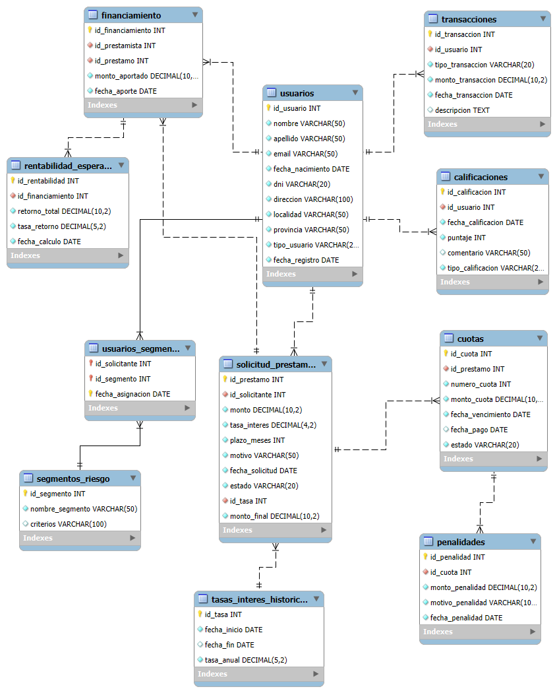

---


---
Introducción
---

El surgimiento y avance de la economía digital, junto con la introducción de nuevas fuentes de financiamiento, están cambiando la forma en la que manejamos nuestro dinero. Los sistemas de financiamiento entre pares (Peer-to-Peer o P2P) representan una gran alternativa frente al crédito tradicional. Estos modelos conectan de manera directa a personas que necesitan dinero con aquellas dispuestas a prestarlo a través de plataformas digitales, que se encargan de gestionar, evaluar, asignar y devolver los fondos, eliminando la necesidad de intermediación bancaria.

Este trabajo propone el diseño de una plataforma de microcréditos P2P en MySQL Workbench que permita almacenar, organizar y analizar información clave sobre los usuarios del sistema, así como de las solicitudes de préstamos y su financiamiento, encargándose de la gestión integral del proceso de otorgamiento desde la presentación inicial hasta la devolución de los fondos.

---
Diagrama Entidad-Relación (DER)
---




---
Listado de Tablas
---

1. Usuarios: almacena la información de las personas que utilizan el servicio, ya sea como prestamistas, solicitantes o ambos.

    - id_usuario INT NOT NULL AUTO_INCREMENT PRIMARY KEY
    - nombre VARCHAR(50) NOT NULL
    - apellido VARCHAR(50) NOT NULL
    - email VARCHAR(50) NOT NULL UNIQUE
    - fecha_nacimiento DATE NOT NULL
    - dni VARCHAR(20) NOT NULL
    - direccion VARCHAR(100) NOT NULL
    - localidad VARCHAR(50) NOT NULL
    - provincia VARCHAR(50) NOT NULL
    - tipo_usuario VARCHAR(20) NOT NULL
    - fecha_registro DATE NOT NULL

2. Tasas_Interes_Historicas: guarda la evolución de las tasas de interés a lo largo del tiempo. Sirve para conocer bajo qué condiciones se otorgó cada préstamo. Aquella que no tenga fecha_fin será la vigente.

    - id_tasa INT NOT NULL AUTO_INCREMENT PRIMARY KEY
    - fecha_inicio DATE NOT NULL
    - fecha_fin DATE					
    - tasa_anual DECIMAL(5,2) NOT NULL

3. Solicitud_Prestamos: registra los préstamos solicitados por los usuarios. El estado del préstamo puede ser pagado, vencido o pendiente.

    - id_prestamo INT NOT NULL AUTO_INCREMENT PRIMARY KEY
    - id_solicitante INT NOT NULL
    - monto DECIMAL(10,2) NOT NULL
    - tasa_interes DECIMAL (4,2) NOT NULL
    - plazo_meses INT NOT NULL
    - motivo VARCHAR(50) NOT NULL
    - fecha_solicitud DATE NOT NULL
    - estado VARCHAR(20) NOT NULL
    - id_tasa INT NOT NULL
    - monto_final DECIMAL(10,2) NOT NULL
    - FOREIGN KEY (id_solicitante) REFERENCES Usuarios(id_usuario)	
    - FOREIGN KEY (id_tasa) REFERENCES Tasas_Interes_Historicas(id_tasa)

4. Financiamiento: registra los aportes de dinero que hacen los usuarios prestamistas a los préstamos solicitados. Un préstamo puede ser financiado por uno o varios prestamistas y un prestamista puede participar en uno o varios préstamos.

    - id_financiamiento INT NOT NULL AUTO_INCREMENT PRIMARY KEY
    - id_prestamista INT NOT NULL
    - id_prestamo INT NOT NULL
    - monto_aportado DECIMAL(10,2) NOT NULL
    - fecha_aporte DATE NOT NULL
    - FOREIGN KEY (id_prestamista) REFERENCES Usuarios(id_usuario)
    - FOREIGN KEY (id_prestamo) REFERENCES Solicitud_Prestamos(id_prestamo)

5. Cuotas: contiene las cuotas que el usuario solicitante debe pagar para devolver el préstamo. El estado de las cuotas puede ser pagada, vencida o pendiente.

    - id_cuota INT NOT NULL AUTO_INCREMENT PRIMARY KEY
    - id_prestamo INT NOT NULL
    - numero_cuota INT NOT NULL
    - monto_cuota DECIMAL(10,2) NOT NULL
    - fecha_vencimiento DATE NOT NULL
    - fecha_pago DATE
    - estado VARCHAR(20) NOT NULL
    - FOREIGN KEY (id_prestamo) REFERENCES Solicitud_Prestamos(id_prestamo)	

6. Calificaciones: almacena las evaluaciones del comportamiento financiero de los usuarios como solicitantes de préstamos. El puntaje va del 1 (baja calificación) al 5 (alta calificación).

    - id_calificacion INT NOT NULL AUTO_INCREMENT PRIMARY KEY
    - id_usuario INT NOT NULL
    - fecha_calificacion DATE NOT NULL
    - puntaje INT NOT NULL
    - comentario VARCHAR(50)
    - tipo_calificacion VARCHAR(20) NOT NULL
    - FOREIGN KEY (id_usuario) REFERENCES Usuarios(id_usuario)

7. Transacciones: registra los movimientos financieros de cada individuo, ya sea por aportes de fondos, pago de cuotas, intereses o penalidades.

    - id_transaccion INT NOT NULL AUTO_INCREMENT PRIMARY KEY
    - id_usuario INT NOT NULL
    - tipo_transaccion VARCHAR(20) NOT NULL
    - monto_transaccion DECIMAL(10,2) NOT NULL
    - fecha_transaccion DATE NOT NULL
    - descripcion TEXT
    - FOREIGN KEY (id_usuario) REFERENCES Usuarios(id_usuario)	

8. Penalidades: registra las penalizaciones por incumplimientos o atrasos en los pagos.

    - id_penalidad INT NOT NULL AUTO_INCREMENT PRIMARY KEY
    - id_cuota INT NOT NULL
    - monto_penalidad DECIMAL(10,2) NOT NULL
    - motivo_penalidad VARCHAR(100) NOT NULL
    - fecha_penalidad DATE NOT NULL
    - FOREIGN KEY (id_cuota) REFERENCES Cuotas(id_cuota)	

9. Segmentos_Riesgo: tabla estática que almacena los tipos de segmentos de riesgo de impago disponibles según el siguiente criterio: bajo riesgo (>= 4 sin mora), riesgo medio (2<>3) y alto riesgo (<=1 con mora).

    - id_segmento INT NOT NULL AUTO_INCREMENT PRIMARY KEY
    - nombre_segmento VARCHAR(50) NOT NULL UNIQUE
    - criterios VARCHAR(100)	

10. Usuarios_Segmento: tabla dinámica que especifica a qué segmento pertenece cada usuario y desde cuándo, para guardar el historial de clasificación de riesgo de cada uno.

    - id_solicitante INT NOT NULL
    - id_segmento INT NOT NULL
    - fecha_asignacion DATE NOT NULL
    - PRIMARY KEY (id_solicitante, id_segmento, fecha_asignacion)
    - FOREIGN KEY (id_solicitante) REFERENCES Usuarios(id_usuario)
    - FOREIGN KEY (id_segmento) REFERENCES Segmentos_Riesgo(id_segmento)	

11. Rentabilidad_Esperada: almacena la rentabilidad obtenida por cada prestamista en cada aporte de dinero.

    - id_rentabilidad INT NOT NULL AUTO_INCREMENT PRIMARY KEY
    - id_financiamiento INT NOT NULL
    - retorno_total DECIMAL(10,2) NOT NULL
    - tasa_retorno DECIMAL(5,2) NOT NULL
    - fecha_calculo DATE NOT NULL
    - FOREIGN KEY (id_financiamiento) REFERENCES Financiamiento(id_financiamiento) 


---
Vistas
---

1. VISTA: ```Distribucion_Credito_Por_Provincia ```

    - Descripción: vista que agrupa y resume la información de las solicitudes de crédito realizadas por los usuarios según la provincia de residencia. Muestra, para cada provincia, el total de solicitudes de  préstamo realizadas, el número total de usuarios que realizaron solicitudes, el monto total solicitado en créditos y el promedio del monto solicitado por solicitud.

    - Objetivo: brindar un análisis geográfico de la distribución del crédito en la plataforma. Esto permite identificar las provincias con mayor demanda de fondos, lo que facilita la toma de decisiones de mercado, de gestión de riesgos y de asignación de recursos.

    - Tablas/Datos: las tablas involucradas son Usuarios, que contiene la información geográfica necesaria, y Solicitud_Prestamos, para conocer los detalles de los préstamos realizados.

    - Codigo:

    ```sql
    CREATE OR REPLACE VIEW Distribucion_Credito_Por_Provincia AS
    SELECT
        u.provincia,
        COUNT(sp.id_prestamo) AS total_solicitudes,
        COUNT(u.id_usuario) AS total_usuarios,
        SUM(sp.monto) AS total_credito_solicitado,
        ROUND(AVG(sp.monto), 2) AS promedio_credito_por_solicitud
    FROM
        Solicitud_Prestamos sp
    JOIN
        Usuarios u ON sp.id_solicitante = u.id_usuario
    GROUP BY
        u.provincia
    ORDER BY
        total_credito_solicitado DESC;
    ```

    - Ejemplo de uso:

    ```sql
    SELECT * FROM Distribucion_Credito_Por_Provincia;
    ```

2. VISTA: ```Volumen_Prestamos_Por_Anio```

    - Descripción: vista que resume los datos de solicitud de préstamos para mostrar el volumen anual de préstamos solicitados. Muestra, para cada año, la cantidad de préstamos solicitados, el monto prestado total y el promedio del monto por préstamo.

    - Objetivo: facilitar el análisis histórico y la toma de decisiones sobre la actividad crediticia anual, sin la necesidad de realizar consultas complejas sobre la tabla de solicitudes de préstamo. Esto ayuda a monitorear tendencias en la demanda de créditos y a planificar estrategias financieras basadas en datos agregados anuales.

    - Tablas/Datos: la tabla involucrada es Solicitud_Prestamos, ya que contiene la información sobre la fecha de solicitud y el monto de los préstamos solicitados.

    - Codigo:

    ```sql
    CREATE OR REPLACE VIEW Volumen_Prestamos_Por_Anio AS
    SELECT
        YEAR(fecha_solicitud) AS anio,
        COUNT(*) AS cantidad_prestamos,
        SUM(monto) AS monto_total_prestado,
        ROUND(AVG(monto), 2) AS promedio_monto_prestado
    FROM
        Solicitud_Prestamos
    GROUP BY
        YEAR(fecha_solicitud)
    ORDER BY
        anio;
    ```

    - Ejemplo de uso:

    ```sql
    SELECT * FROM Volumen_Prestamos_Por_Anio;
    ```
   
3. VISTA: ```Segmento_Riesgo_Actual```

    - Descripción: vista que muestra el segmento de riesgo más reciente asignado a cada solicitante de préstamos. Incluye información básica como nombre, apellido, provincia, localidad, además del nombre del segmento de riesgo asignado, el criterio de segmentación correspondiente y la fecha de asignación del mismo. Si el segmento de riesgo es nulo, significa que ese usuario aún no tiene asignado uno.

    - Objetivo: facilitar el análisis del nivel de riesgo de los solicitantes según los criterios predefinidos de la plataforma, para mejorar el proceso de toma de decisiones de los prestamistas y minimizar el riesgo de impago.

    - Tablas/Datos: las tablas involucradas son Usuarios, que brinda la información básica necesaria sobre cada uno de ellos, Usuarios_Segmento, que contiene el historial de segmentos asignados, y Segmentos_Riesgo, que contiene el criterio de clasificación y el nombre de cada segmento.
  
    - Codigo:

    ```sql
    CREATE OR REPLACE VIEW Segmento_Riesgo_Actual AS
    SELECT 
        u.id_usuario,
        u.nombre,
        u.apellido,
        u.provincia,
        u.localidad,
        sr.nombre_segmento,
        sr.criterios,
        us.fecha_asignacion			
    FROM 
        Usuarios u			
    LEFT JOIN ( 			
	    SELECT us1.* 										
	    FROM Usuarios_Segmento us1
	    JOIN (
		    SELECT id_solicitante, MAX(fecha_asignacion) AS max_fecha		
		    FROM Usuarios_Segmento
		    GROUP BY id_solicitante
	    ) us2 
	    ON us1.id_solicitante = us2.id_solicitante 
	    AND us1.fecha_asignacion = us2.max_fecha 	
    ) us 
    ON u.id_usuario = us.id_solicitante		
    LEFT JOIN Segmentos_Riesgo sr 		
    ON us.id_segmento = sr.id_segmento
    WHERE u.tipo_usuario IN ('solicitante', 'ambos');  
    ```

    - Ejemplo de uso:
  
    ```sql
    SELECT * FROM Segmento_Riesgo_Actual;
    ```

4. VISTA: ```Morosidad_Prestamos```

    - Descripción: vista que muestra los préstamos que tienen cuotas vencidas, teniendo en cuenta los datos básicos del préstamo como el solicitante, el monto original y final del préstamo y la fecha de solicitud, así como el número total de cuotas vencidas, el monto total pendiente de pago y los días de atraso máximos.

    - Objetivo: identificar aquellos préstamos con morosidad activa para priorizar la cobranza de las cuotas o ajustar el riesgo de impago.

    - Tablas/Datos: las tablas involucradas son Solicitud_Prestamos, que se utiliza para obtener la información general del préstamo y del solicitante, y Cuotas, que permite filtrar las cuotas ‘vencidas’ para contabilizarlas y calcular tanto el monto adeudado como los días de atraso en el pago.
  
    - Codigo:
  
     ```sql
    CREATE OR REPLACE VIEW Morosidad_Prestamos AS
    SELECT 
        sp.id_prestamo,
        sp.id_solicitante,
        sp.monto AS monto_original,
        sp.monto_final,
        sp.fecha_solicitud,
        COUNT(c.id_cuota) AS cuotas_atrasadas,
        SUM(c.monto_cuota) AS total_pendiente,
        MAX(DATEDIFF(c.fecha_pago, c.fecha_vencimiento)) AS max_dias_atraso
    FROM 
        Solicitud_Prestamos sp
    JOIN 
        Cuotas c ON sp.id_prestamo = c.id_prestamo
    WHERE 
        c.estado = 'vencida'
    GROUP BY 
        sp.id_prestamo, sp.id_solicitante, sp.monto, sp.monto_final, sp.fecha_solicitud;
    ```

    - Ejemplo de uso:
  
    ```sql
    SELECT * FROM Morosidad_Prestamos;
    ```

5. VISTA: ```Objetivos_Financieros_Usuarios```

    - Descripción: vista que agrupa las solicitudes de préstamos según el motivo de solicitud de los usuarios, ya sea para vivienda, educación, consumo o capital. Incluye, para cada tipo de objetivo financiero, la cantidad de préstamos otorgados, el monto total de los mismos y el monto promedio destinado de cada uno.

    - Objetivo: registrar las metas financieras de los usuarios al solicitar préstamos, facilitando la identificación de patrones de uso de fondos, tendencias de demanda por tipo de necesidad y la priorización de recursos financieros según el destino más frecuente o costoso. Esto permite ajustar la estrategia de financiamiento y segmentar a los solicitantes según sus necesidades de fondos, útil para análisis de impacto social.

    - Tablas/Datos: la tabla involucrada es Solicitud_Prestamos, que se utiliza para acceder al campo Motivo, y para calcular las métricas de cantidad, suma y promedio de los préstamos asociados a cada objetivo.
  
    - Codigo:
  
    ```sql
    CREATE OR REPLACE VIEW Objetivos_Financieros_Usuarios AS
    SELECT 
        motivo AS tipo_objetivo,
        COUNT(*) AS cantidad_prestamos,
        SUM(monto) AS monto_total,
        ROUND(AVG(monto), 2) AS promedio_monto
    FROM 
        Solicitud_Prestamos
    GROUP BY 
        motivo
    ORDER BY 
        monto_total DESC;
    ```

   - Ejemplo de uso:

   ```sql
   SELECT * FROM Objetivos_Financieros_Usuarios;
   ```

---
Funciones
---

1. FUNCION: ```CalcularRentabilidadPromedio```

    - Descripción: función que calcula la tasa de rentabilidad promedio obtenida por un prestamista en base a los aportes de dinero (financiamiento) que ha realizado en la plataforma. Tiene en cuenta el número de identificación del prestamista para devolver la media de las tasas de retorno de cada aporte realizado, que se agrupan en la tabla de rentabilidad esperada. Si el prestamista no tiene una rentabilidad registrada, devuelve null.

    - Objetivo: automatizar el cálculo de la rentabilidad promedio de cada prestamista, facilitando la elaboración de reportes financieros, análisis de desempeño y comparaciones entre usuarios.

    - Tablas/Datos: las tablas involucradas son Financiamiento, que relaciona los préstamos con los prestamistas, y la Rentabilidad_Esperada, que contiene el cálculo del retorno total y la tasa de rentabilidad por aporte.

    - Codigo:

    ```sql
    DELIMITER //

    CREATE FUNCTION CalcularRentabilidadPromedio(id_prestamista_input INT)		
    RETURNS DECIMAL(5,2)
    DETERMINISTIC					
    READS SQL DATA					
    BEGIN
        DECLARE rentabilidad_promedio DECIMAL(5,2);		

        SELECT ROUND(AVG(re.tasa_retorno), 2)
        INTO rentabilidad_promedio
        FROM Rentabilidad_Esperada re
        JOIN Financiamiento f ON re.id_financiamiento = f.id_financiamiento
        WHERE f.id_prestamista = id_prestamista_input;

    RETURN rentabilidad_promedio;
    END //

    DELIMITER ;
    ```

    - Ejemplo de uso:
  
   ```sql
   SELECT CalcularRentabilidadPromedio(1) AS retorno_promedio;
   ```

2. FUNCION: ```ObtenerMontoPenalidadPorUsuario```

    - Descripción: función que devuelve el monto total acumulado de penalidades asociadas a un solicitante de préstamo. Utiliza el id del usuario como punto de partida, para luego incorporar datos de la solicitud del préstamo, de las cuotas vencidas y de los montos de la penalidad. Si el solicitante no tiene penalidades, devuelve null.

    - Objetivo: evaluar el nivel de incumplimiento en pagos por parte de un usuario solicitante, para realizar análisis de riesgo o reportes de morosidad. También es útil para que el solicitante conozca el monto adeudado y para que los usuarios que financian los préstamos conozcan el riesgo asociado a cada usuario.

    - Tablas/Datos: las tablas involucradas son la de Usuarios (para obtener el id), la de Solicitud_Prestamos (para obtener los id de préstamo y de solicitante), la de Cuotas (para conocer la cantidad de cuotas vencidas) y la de Penalidades (que posee el cálculo de del monto de la penalidad).
  
    - Codigo:
  
    ```sql
    DELIMITER $$

    CREATE FUNCTION ObtenerMontoPenalidadPorUsuario(p_id_usuario INT)		
    RETURNS DECIMAL(10,2)
    DETERMINISTIC
    READS SQL DATA
    BEGIN
        DECLARE total_penalidades DECIMAL(10,2);

        SELECT COALESCE(SUM(p.monto_penalidad), 0)		
        INTO total_penalidades
        FROM Usuarios u
        JOIN Solicitud_Prestamos sp ON u.id_usuario = sp.id_solicitante
        JOIN Cuotas c ON sp.id_prestamo = c.id_prestamo
        JOIN Penalidades p ON c.id_cuota = p.id_cuota
        WHERE u.id_usuario = p_id_usuario;

        RETURN total_penalidades;
    END $$

    DELIMITER ;
    ```

    - Ejemplo de uso:
  
   ```sql
   SELECT ObtenerMontoPenalidadPorUsuario(2) AS penalidades_totales;
   ```

---
Stored Procedures
---

1. STORED PROCEDURE: ```ActualizarEstadoPrestamo```

    - Descripción: procedimiento almacenado que actualiza el estado de un préstamo en función del estado de sus cuotas asociadas. El parámetro de entrada es el id del préstamo, luego consulta la tabla Cuotas para identificar si las cuotas han sido pagadas (fecha_pago not null), si existen cuotas vencidas sin pagar o si no han sido pagadas aún porque no se vencieron, y por ultimo, actualiza el campo Estado de la tabla Solicitud_Prestamos según este ‘Pagado’, ‘Pendiente’ o ‘En Mora’. Debe ejecutarse con un CALL manualmente para cada préstamo.

    - Objetivo: facilitar la actualización del estado de los préstamos, garantizando que la información refleje correctamente la situación actual de pago por parte del prestatario. Esto evita inconsistencias en los datos, reduce la necesidad de intervención manual y permite generar reportes financieros más precisos.

    - Tablas/Datos: las tablas involucradas son Cuotas, de la cual utilizamos el id y las fechas de pago y de vencimiento, y Solicitud_Prestamos, en la cual modificamos el campo Estado.
  
    - Codigo:
  
    ```sql
    DELIMITER //

    CREATE PROCEDURE ActualizarEstadoPrestamo(IN p_id_prestamo INT)		
    BEGIN
        DECLARE cuotas_sin_pagar INT;		
        DECLARE cuotas_vencidas INT;

        -- Cuotas que no han sido pagadas
        SELECT COUNT(*) INTO cuotas_sin_pagar
        FROM Cuotas
        WHERE id_prestamo = p_id_prestamo AND fecha_pago IS NULL;

        -- Cuotas no pagadas que ya están vencidas
        SELECT COUNT(*) INTO cuotas_vencidas
        FROM Cuotas
        WHERE id_prestamo = p_id_prestamo AND fecha_pago IS NULL AND fecha_vencimiento < CURDATE();
	
        -- Condicional
        IF cuotas_sin_pagar = 0 THEN
            -- Todas las cuotas están pagadas
            UPDATE Solicitud_Prestamos
            SET estado = 'Pagado'
            WHERE id_prestamo = p_id_prestamo;

        ELSEIF cuotas_vencidas > 0 THEN
            -- Hay cuotas no pagadas y vencidas
            UPDATE Solicitud_Prestamos
            SET estado = 'En Mora'
            WHERE id_prestamo = p_id_prestamo;

        ELSE
            -- Hay cuotas no pagadas pero no están vencidas
            UPDATE Solicitud_Prestamos
            SET estado = 'Pendiente'
            WHERE id_prestamo = p_id_prestamo;
        END IF;
    END //

    DELIMITER ;
    ```

    - Ejemplos de uso: 
  
    ```sql
    CALL ActualizarEstadoPrestamo(1);
    CALL ActualizarEstadoPrestamo(2);
    CALL ActualizarEstadoPrestamo(3);
    ```

2. STORED PROCEDURE: ```RegistrarNuevoPrestamo```
  
    - Descripción: procedimiento almacenado que registra un nuevo préstamo solicitado por un usuario. Como parámetros de entrada posee el id del solicitante, el monto solicitado, el plazo de pago y el motivo del préstamo. Luego, se encarga de recuperar la tasa de interés vigente de la tabla Tasas_Interes_Historicas y calcula el monto final del préstamo con un interés simple. Por último, crea un nuevo registro en la tabla Solicitud_Prestamos con estado ‘Pendiente’.
    
    - Objetivo: centralizar y automatizar el proceso de registro de nuevos préstamos en la plataforma, utilizando la tasa de interés vigente y aplicando un cálculo estandarizado del monto final a devolver. Esto mejora la integridad de los datos al evitar que se ingresen préstamos sin asociar correctamente la tasa vigente o sin aplicar los cálculos adecuados.

    - Tablas/Datos: las tablas involucradas son Tasas_Interes_Historicas para obtener la tasa de interés vigente (fecha_fin IS NULL) y Solicitud_Prestamos, en la cual agregamos un nuevo registro.
  
    - Codigo:
  
   ```sql
   DELIMITER //

    CREATE PROCEDURE RegistrarNuevoPrestamo(	
        IN p_id_solicitante INT,
        IN p_monto DECIMAL(10,2),
        IN p_plazo_meses INT,
        IN p_motivo VARCHAR(50)
    )
    BEGIN
        DECLARE v_id_tasa INT;					
        DECLARE v_tasa_anual DECIMAL(5,2);
        DECLARE v_monto_final DECIMAL(10,2);

       -- Obtener la tasa vigente
        SELECT id_tasa, tasa_anual INTO v_id_tasa, v_tasa_anual
        FROM Tasas_Interes_Historicas
        WHERE fecha_fin IS NULL
        LIMIT 1;

        -- Calcular monto final con interés simple
        SET v_monto_final = p_monto + (p_monto * (v_tasa_anual / 100) * (p_plazo_meses / 12));

        -- Insertar nuevo préstamo
        INSERT INTO Solicitud_Prestamos (id_solicitante, monto, tasa_interes, plazo_meses, motivo, fecha_solicitud, estado, id_tasa, monto_final)
        VALUES (p_id_solicitante, p_monto, v_tasa_anual, p_plazo_meses, p_motivo, CURDATE(), 'Pendiente', v_id_tasa, v_monto_final);
    
    END //

    DELIMITER ;
   ```

    - Ejemplo de uso:
  
    ```sql
    CALL RegistrarNuevoPrestamo(10, 20000.00, 2, 'Vivienda');
    SELECT * FROM Solicitud_Prestamos WHERE id_solicitante = 10 ORDER BY id_prestamo DESC LIMIT 1;
    ```

---
Triggers
---

1. TRIGGER: ```tr_actualizar_estado_cuota```

    - Descripción: trigger que se activa automáticamente antes de cada actualización en el pago de las cuotas. Su función es verificar si hubo un cambio en el campo fecha_pago de la tabla Cuotas y compararlo con la fecha_vencimiento para determinar y actualizar automáticamente el campo Estado de la cuota. Si la cuota fue pagada (fecha_pago no es NULL), se asigna el estado 'pagada', independientemente de si el pago fue puntual o con retraso. Si no fue pagada y ya venció, se actualiza a 'vencida'. Si no fue pagada y aún está dentro del plazo, se actualiza a 'pendiente'.

    - Objetivo: automatizar la asignación del estado de una cuota al momento de actualizarla. Evita inconsistencias y asegura que los registros de cuotas reflejen correctamente su situación (pagada, pendiente o vencida) sin depender de la intervención manual. Esto facilita el seguimiento de pagos, mejora el control de la mora, y garantiza la integridad de los datos en el sistema financiero.

    - Evento disparador: actualizar una fecha de pago en la tabla Cuotas (UPDATE).

    - Tabla asociada: Cuotas, ya que se activa ante cambios en la misma.

    - Tablas afectadas: Cuotas, ya que se modifica el estado de las mismas.
  
    - Codigo:
  
   ```sql
   DELIMITER $$

    CREATE TRIGGER tr_actualizar_estado_cuota
    BEFORE UPDATE ON Cuotas
    FOR EACH ROW
    BEGIN
  
       IF NEW.fecha_pago IS NOT NULL THEN
  
        -- Si se pagó antes o en la fecha límite → 'pagada'
        IF NEW.fecha_pago <= NEW.fecha_vencimiento THEN
          SET NEW.estado = 'Pagada';
        ELSE
          SET NEW.estado = 'Pagada'; 			
        END IF;
  
       ELSE
  
        -- Si aún no se pagó
        IF NEW.fecha_vencimiento < CURDATE() THEN
          SET NEW.estado = 'Vencida';
        ELSE
          SET NEW.estado = 'Pendiente';
        END IF;
      END IF;
  
    END$$

    DELIMITER ;
    ```
  
    - Ejemplo de uso: se ubica alguna cuota pendiente de pago (sin fecha_pago), como la cuota 7 del préstamo 4, y se actualiza la fecha de pago a HOY. Esto modifica el campo Estado de la tabla Cuotas a ‘Pagada’

    ```sql
    SELECT id_cuota, id_prestamo FROM Cuotas WHERE fecha_pago IS NULL;

    UPDATE Cuotas
    SET fecha_pago = CURDATE()
    WHERE id_cuota = 7;

    SELECT * FROM Cuotas WHERE id_cuota = 7;
    ```

1. TRIGGER: ```tr_insertar_transaccion_aporte```

    - Descripción: trigger que se activa automáticamente después de que se inserta un nuevo registro en la tabla Financiamiento. Su función es insertar una nueva transacción financiera en la tabla Transacciones, correspondiente al aporte de dinero realizado por un prestamista. Va a tomar los datos del nuevo aporte (prestamista, monto, fecha, ID del préstamo) y los va a utilizar para generar un registro con tipo 'aporte' como nueva transacción.

    - Objetivo: automatizar el registro de movimientos financieros cada vez que un usuario realiza un aporte a un préstamo. Elimina la necesidad de registrar manualmente las transacciones relacionadas con aportes, mejorando la consistencia, integridad y transparencia de los datos financieros. Puede repetirse el mismo trigger para transacciones por intereses, pago o penalidad.

    - Evento disparador: insertar un nuevo registro en la tabla Financiamiento (INSERT).

    - Tabla asociada: Financiamiento, ya que se activa ante cambios en la misma.

    - Tablas afectadas: Transacciones, ya que se añade un nuevo registro.

    - Codigo:
  
   ```sql
   DELIMITER $$

    CREATE TRIGGER tr_insertar_transaccion_aporte
    AFTER INSERT ON Financiamiento
    FOR EACH ROW
    BEGIN

        INSERT INTO Transacciones (
            id_usuario,
            tipo_transaccion,
            monto_transaccion,
            fecha_transaccion,
            descripcion
        )
        VALUES (
            NEW.id_prestamista,
            'aporte',
            NEW.monto_aportado,
            NEW.fecha_aporte,
            CONCAT('Aporte al préstamo ', NEW.id_prestamo)
        );
    
    END$$

    DELIMITER ;
    ```

   - Ejemplo de uso: se inserta un nuevo aporte de dinero en la tabla Financiamiento (id_financiamiento 19) y se comprueba su correcta inserción en la tabla Transacciones (id_transaccion 46)

   ```sql
   INSERT INTO Financiamiento (id_prestamista, id_prestamo, monto_aportado, fecha_aporte)
   VALUES (11, 9, 20000.00, CURDATE());

   SELECT * FROM Transacciones WHERE id_transaccion = 46;
   ```

---
Archivos SQL
---

- [Creacion de Base de Datos y Tablas](SCRIPTS/01-STRUCTURE.sql)
- [Inserción de Datos](SCRIPTS/02-POPULATION.sql)
- [Creacion de Vistas](SCRIPTS/03-VIEWS.sql)
- [Creacion de Funciones](SCRIPTS/04-FUNCTIONS.sql)
- [Creacion de Procedimientos Almacenados](SCRIPTS/05-STORED-PROCEDURES.sql)
- [Creacion de Triggers](SCRIPTS/06-TRIGGERS.sql)

---
Informes
---

Los gráficos generados a partir de vistas construidas sobre la base de datos de la plataforma permiten obtener una visión consolidada y cuantitativa del funcionamiento del sistema de microcréditos. Cada uno de ellos se enfocó en un aspecto clave del modelo, brindando información relevante para la gestión de riesgos, la evaluación de la actividad crediticia y la toma de decisiones.

El análisis de la distribución geográfica del crédito por provincia evidenció diferencias significativas en la demanda de préstamos. De nueve préstamos otorgados, el 44% se concentró en la provincia de Buenos Aires (cuatro préstamos), mientras que Santa Fe representó el 22% (dos préstamos), y las provincias de Chaco, Mendoza y San Juan registraron un préstamo cada una (11% respectivamente). Esta distribución permite identificar una concentración relativa en ciertas regiones, como en la capital del país, sugiriendo oportunidades para aumentar la asignación de recursos en dichas áreas, o para mejorar la equidad en el acceso al crédito en las restantes.

   
